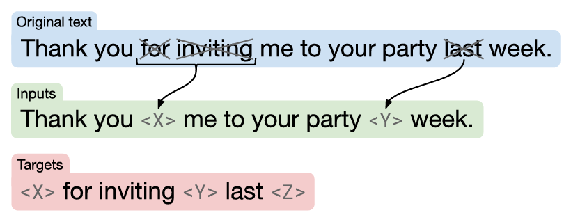
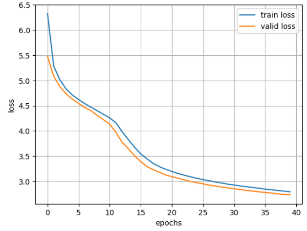

# US Stock Market News Sentiment Classification

## 1. 프로젝트 목표
프로젝트의 목표는 미국 증시 관련 뉴스 문장을 입력받아, 해당 뉴스가 시장 관점에서 bearish, neutral, bullish 가운데 어느 방향성에 해당하는지를 예측하는 domain-specific small language model을 구축하는 것이다. 
 
프로젝트에서 모델 학습에 대한 가설은 small scale unlabeld text corpus로 pre-training한 다음, 동일한 도메인의 task 대해 fine-tuning을 수행하면 distribution shift가 발생할 가능성을 최대한 차단하여 합리적인 성능을 달성할 수 있다는 것이다. 

약 54M의 pre-training data로 학습한 모델이 downstream task에서 약 83%의 정확도 달성하였다. 이는 일반적인 말뭉치만으로는 포착하기 어려운 실적 발표 표현, 가격 변동 서술, 거시경제 이벤트, 금융 전문 용어 등에 따른 패턴을 충분히 모델 파라미터에 내재화함으로써, downstream task에서 합리적인 수준의 성능을 달성할 수 있음을 보여준다. 

---

## 2. 데이터셋 선정

사전학습에는 article-level의 [Bloomberg Financial News 120k](https://huggingface.co/datasets/genloop/bloomberg_financial_news_120k),  파인튜닝에는 Bearish/Neutral/Bullish 레이블이 부여된 sentence-level의 [Yahoo Finance News Sentences](https://huggingface.co/datasets/ugursa/Yahoo-Finance-News-Sentences)를 사용한다. 두 데이터 모두 금융 관련 기사 및 뉴스로 domain match이다. 

---

## 3. 모델 아키텍처
프로젝트에 사용한 모델은 encoder–decoder Transformer이며, positional encoding과 pretraining objective는 [T5](https://arxiv.org/abs/1910.10683)의 방식을 따른다. 

T5에서는 original Transformer의 absolute positional encoding 대신 relative position buckets 방식으로, relative position bias를 attention에 반영하는 방식을 사용한다. 

query와 key의 내적 값으로 계산된 attention score에 두 토큰 간 거리에 대응하는 학습 가능한 relative position bias를 더한다. 이때 토큰 간의 거리를 여러 개의 bucket에 할당하기 때문에, 가까운 위치 간의 거리는 세밀하게 구분하고, 거리가 멀어질수록 서로 다른 거리 값들을 하나의 bucket으로 통합하여 동일한 상대 위치로 처리한다. 그 결과, length generalization 측면에서 이점을 가진다.

encoder와 decoder는 각각 6 layers, hidden dimension 512, intermediate layer dimension은 $4d_{model}$, attention head 수는 8을 사용한다. 

vocabulary size는 50,359이며, 파라미터 효율을 높이기 위해 output projection matrix와 embedding matrix 간에 weight tying을 적용한 결과, 전체 모델 크기는 약 70M 규모의 small model이다.

RMSNorm을 적용한 Pre-LN 구조를 채택하였으며, FFN의 activation function은 GELU를 적용하였다.  

금융 뉴스에서는 ticker 그리고 다양한 숫자와 결합된 %, $, -, + 등의 기호가 빈번하게 등장한다. 이러한 표현을 효과적으로 처리하기 위해 GPT-2 tokenizer를 사용하였다. 참고로 vocabulary size가 50,359인 이유는 special token인 sentinel tokens을 추가했기 때문이다. 

GPT-2 tokenizer는 텍스트를 바이트 단위로 분해한 뒤, 자주 등장하는 쌍을 합치기 때문에 모든 텍스트를 처리할 수 있어 out-of-vocabulary가 발생하지 않는다. 

---

## 4. slim attention
일반적으로 추론 단계에서는 self-attention 연산 과정에서 동일한 token에 대한 중복 계산을 줄이기 위해, 이전에 계산한 key $K$와 value $V$를 메모리에 저장해 재사용하는 KV-cache를 사용한다.

그러나 추론 과정에서 new token이 생성될 때마다 해당 토큰의 $K$, $V$ 벡터가 캐시에 누적되므로, KV-cache의 메모리 사용량은 시퀀스 길이에 선형적으로 증가한다.

이로 인해 KV-cache는 모델 파라미터 다음으로 큰 GPU 메모리를 차지하게 된다. 이러한 메모리 제약은 batch size를 상당히 제한하기 때문에 throughput 저하로 이어진다. 

[slim attention](https://arxiv.org/abs/2503.05840)은 이러한 비효율을 줄이기 위해 V-cache를 제거하고 K-cache만 유지한다. 이론적으로 KV-cache 메모리를 절반 수준으로 줄일 수 있어 생성 속도 개선을 기대할 수 있다. 

standard MHA에서 input이 $X$라 하면, $K=X W_k, \; V=X W_V$로 계산된다. 이때 $W_K$가 가역이라면, $X=K W_K^{-1}$가 된다. 

이를 이용하면 $V$는 다음과 같이 쓸 수 있다. 
$$V= K (W_K^{-1} W_V)=K W_{KV}$$

추론 시점에서 $K$만 캐싱한 뒤, 미리 계산해 둔 $W_{KV}=W_K^{-1} W_V$를 통해 $V$를 산출할 수 있다. 그러므로 generate phase에서 계산량은 다소 증가할 수 있으나, memory-bound인 경우 추론 속도가 향상될 수 있다. 

---

## 5. 학습

pretraining은 sequence packing을 통해 512 tokens로 구성된 입력 시퀀스로 수행되며, T5의 pretraining objective인 span corruption을 사용한다. 

sequence packing은 배치 학습을 위해 pad token을 추가하는 대신, 여러 텍스트를 연속적인 고정 길이 블록으로 구성함으로써, 무의미한 padding token에 대한 연산 낭비를 줄이기 위해 사용한다. 

sequence packing이 적용된 입력 시퀀스에서 전체 토큰의 15%를 corruption 대상으로 선택하고, 평균 span 길이 3이 되도록 연속된 noise span을 무작위로 생성한다. 이후 각 noise span의 시작 위치를 sentinel token으로 치환하고, 동일 span의 나머지 토큰은 제거한다. 

예측 대상은 sentinel tokens로 교체된 부분이기 때문에, 타겟 시퀀스의 길이가 줄어들고 이에 따른 계산 비용도 절감된다. 

  

이러한 noising 처리는 RoBERTa의 dynamic masking 전략을 적용하여 학습 시점에 동적으로 생성되도록 구현하였다.

Adafactor optimizer와 inverse square root scheduler를 사용하며, learning rate 0.01, warmup steps는 total training steps의 약 10%, gradient clipping 0.1을 적용하였고, 학습에는 mixed precision을 사용한다. 그리고 validation loss가 8회 개선되지 않을 경우 학습을 중단하도록 설정하였다.

아래는 pretraining을 수행한 결과이다. 

  

pretraining 단계에서는 learning rate 0.01을 사용했지만, finetuning 단계에서는 사전학습된 파라미터를 기반으로 downstream task에 맞게 미세 조정을 수행해야 하므로, 기존 표현을 안정적으로 유지하기 위해 작은 learning rate 2e-5를 사용한다. 

learning rate를 포함한 하이퍼파라미터들은 예비 실험을 통해 성능을 비교한 후, 가장 안정적인 결과를 보인 setting으로 결정하였다. 

---

## 6. 결과

54M tokens 데이터로 70M 규모의 encoder–decoder Transformer를 pretraining한 뒤, 동일한 도메인의 데이터로 fine-tuning을 수행한 결과 test accuracy 83.41%를 달성했다. <code>run_finetuning.ipynb</code>

이는 대규모의 일반 말뭉치에 의존하지 않더라도 pretraining data와 downstream task data의 도메인이 일치하면, 소규모의 pretraining이 성능 향상에 도움이 될 수 있음을 보여주는 결과이다. 

finetuning 과정에서 train accuracy는 꾸준히 상승하는 반면, validation accuracy는 일정 시점 이후 정체되거나 소폭 하락하는 과적합 경향이 나타나 early stopping에 의해 학습이 조기 종료되었다. 

early stopping에 의해 조기 종료된 모델을 기준으로 validation 및 test accuracy를 측정한 결과, 두 성능 간의 차이가 크지 않았다. 이는 unseen data에 대해서도 일정 수준의 일반화 성능을 확보했음을 시사한다.

다만 이 프로젝트에는 몇 가지 한계가 존재한다. 

첫째, pretraining data로 다양한 도메인이 혼합된 대규모 말뭉치 대신 단일 금융 도메인 말뭉치를 선택했다. 이러한 설계는 downstream task에서 합리적인 성능을 달성하는 데에는 도움이 될 수 있으나, 모델이 학습할 수 있는 표현의 범위에는 한계가 존재한다.

예를 들어, 희귀한 시장 이벤트나 특정 기업명, 특정 시기나 섹터에서만 나타나는 표현, 혹은 데이터에 포함되지 않은 거시경제 상황에 대해서는 충분한 학습이 이루어지지 않았을 가능성이 있다. 더구나 주식 시장의 특성상 동일한 문장이라도 당시의 시장 분위기나 기대치, 이미 가격에 반영된 정도에 따라 해석이 달라질 수 있기 때문에, 소규모 말뭉치만으로 이러한 맥락적 다양성을 완전히 포착하기는 어렵다.

둘째, 사전학습과 파인튜닝 데이터가 모두 금융 뉴스라는 점은 distribution shift를 줄이는 데 분명히 도움이 되지만, 이를 완전히 제거한다고 보기는 어렵다. 

Bloomberg Financial News 120k는 article-level이고, Yahoo Finance News Sentences는 sentence-level로 정보 밀도가 더 높다. 즉, 두 데이터셋은 같은 금융 도메인 안에 있더라도 writing style, 정보 밀도 측면에서 차이를 가진다. 

셋째, pretraining objective와 finetuning objective 사이에 불일치가 존재한다. pretraining에서는 span corruption을 사용하지만, finetuning에서는 문장을 bearish, neutral, bullish 중 하나로 분류하는 것이 목표이다.

다시 말해, pretraining은 언어적·문맥적 패턴을 익히는 과정이고, 파인튜닝은 시장 방향성을 판단하는 분류 문제이기 때문에 두 목적이 정확히 일치하지는 않는다.

pretraining으로 금융 텍스트에 대한 표현 학습에는 도움을 줄 수 있지만, 그것만으로 시장 관점의 심리를 직접적으로 학습하는 것은 아니다. 결국 이 프로젝트의 성능은 도메인 지식이 반영된 표현 학습과 레이블이 있는 분류 학습이 결합된 결과이다. 

넷째, small model을 만들기 위해 6 layers를 사용했지만, 줄어든 레이어 수로 인한 성능 저하를 고려하지 않았다. 이를 보완하기 위해 상대적으로 넓은 hidden dimension($d_{model}$)을 사용할 필요가 있다. 
